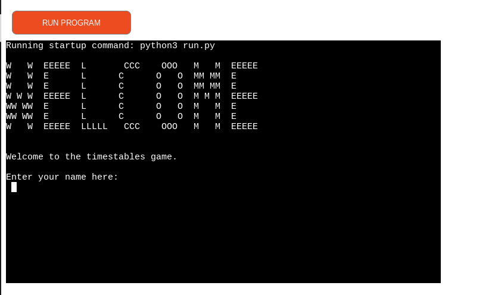
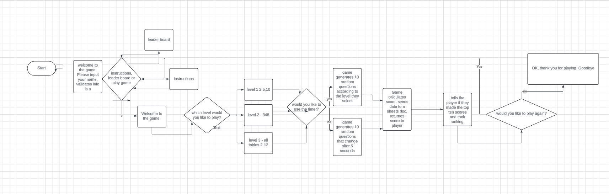
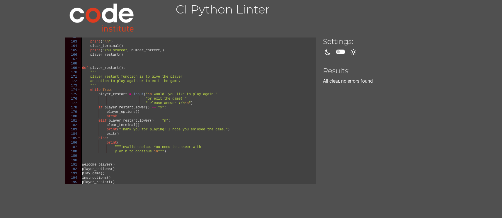
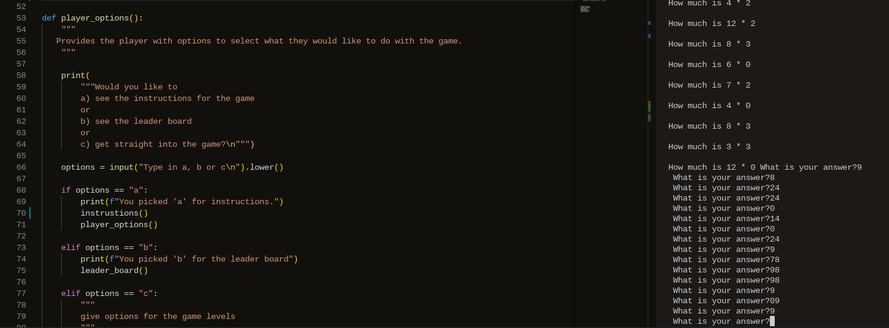
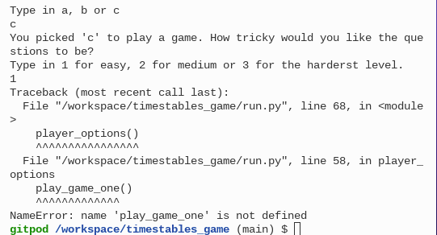
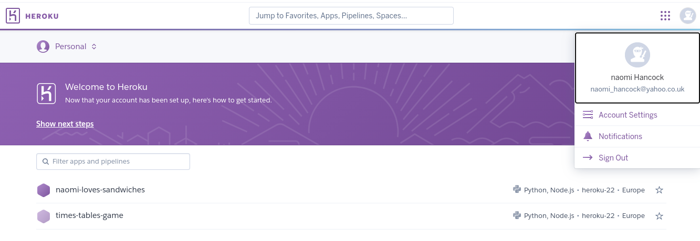

# Times tables practice game
## Welcome to milestone Project 3

This is my third project for the Code Institute full stack developer course. I have created a command-line application allowing users to practice their mulitplication tables in preparation for the [Year 4 national multiplication tests](https://www.gov.uk/government/collections/multiplication-tables-check). The application gives the user options as to which level of difficulty they would like to try and then generates random multiplication questions. The user should try to answer the questions as quickly as possible. 
 
## Homepage
Game can be played here:
[In application game on Heroku](https://times-tables-game-ce579d4de65e.herokuapp.com/)

## User Experiences(UX)

# A student user's point of view
The student will have a simple, easy to follow game to help them to develop their multiplication skills. The instructions are clear, easy to read and understand. 
Thre is the opportunity for the students to create a player name and to view their scores and then they can monitor their progress and move up the levels as they attain higher scores. The game is quick with just 10 questions, so the student should not get too bored before completeing the task. The instant feedback for each questions allows the student to know which questions they are getting correct or not. 
# From a teachers’ point of view
Instructions for the game are clear and simple. Teachers will be able to monitor and log the students level and score so they can see if the child is making progress or if they need more support. As the application is simple and short, it can give a quick and clear insight into the child's abilities and knowledge of their multiplication tables. 

# Design

## Lucid Flow charts
When planning out the site I used a mixture of Google slides [planning flowchart on Lucid](https://lucid.app/lucidchart/d10182aa-ba39-42a5-b35a-7cccb7152c44/edit?invitationId=inv_387de66f-fc68-4733-9822-e6e0b774ea69) the flow charts of Lucid helped me to plan out the application and to understand the functions I would need and how they link together. 

## Features
* Welcome message for the user to input their name
* Instructions on how to play
* Three levels of difficulty for the user to Select
* Instant feedback if the question is correct or incorrect
* The user score is displayed
* Options to restart the game or to leave the game
* Exiting message 
* Input validation for the options and answers
* Error messgae to guide the user on how to inut the correct type of information

# Technologies Used
* [Python](https://www.python.org/)
   to create the entire project.
* [GitHub](https://github.com/)
   to securely store my code.
* [Heroku](https://www.heroku.com/home?)
  to deploy my application project.
* [Git pod](https://www.gitpod.io/)
  as my coding development environment.
* [Code Institute Python Linter](https://pep8ci.herokuapp.com/)
to validate my code.
* [Lucidchart](https://lucid.co/)
  This technology was used to create my logic map for the project.

## Validator testing
Checks the code through CI Python linter

## Bugs
Variable were placed inside functions so I could not acces them when they were called in another part of the appication. Once I moved them to the top of the appication so they could become global variables then they could be used elsewhere in the program. 

I had mistakenly added some spaces after I had defined my functions but before the perenthasis this meant my functions did not work. 

The input validation was not working when I first tried it.
I reviewed the lesson on CI about Python Exception Errors. I added in a while true and except formula but when I did the console threw back a syntax error. I adjusted the excpect to go above the 'if' statement but then all ten mulitplication questions came up at once and the input of answers no longer matched the questions. 

I removed the try and except on the validation and used while true: and if statements and these appears to be working. this works for the a/b choices and well as the 1/2/3 options. 
. 
On the exit message I have been having trouble getting the program to end. It keep offering more choices to play. At first I had placed the otions to exit or play again within the play_game functions. Then I decided to create a new function.  

I also had trouble trying to call functions before they had been defined in the order of the program. For example I had provided the player with function to view the options to view instructions or to play the game, but then after that defined the instructions function, so I was not able to call it. I resolved this by cut and pasting the instructions code and placing it above the player_options. 

On the exit message "Would you like to play again or exit the game?" I had forgotten to insert the 'y' into a string so I was unable to call the player_options functions. This was quickly fixed by adding (" ") allowing the game to have a smooter finish. Also, when the no option was selected it would send up a thank you goodbye message but then go on to return into the game and offer options for game level. I found the exit() fnction on [free code camp](https://www.freecodecamp.org/news/python-end-program-how-to-exit-a-python-program-in-terminal/#:~:text=Alternatively%2C%20you%20can%20use%20the,and%20Ctrl%20%2B%20D%20in%20macOS.) and this was a simple fix. 

## unfixed bugs - None found

## Deployment
[Heroku]

The site is deployed using GitHub Pages - [timestables_game](https://times-tables-game-ce579d4de65e.herokuapp.com/~)

To Deploy the site using GitHub Pages:

Login (or signup) to Github.
Go to the repository for this project, [nomeski80/timestables_game](https://github.com/nomeski80/timestables_game)
Click the settings button.
Select pages in the left hand navigation menu.
From the source dropdown select main branch and press save.
The site has now been deployed, please note that this process may take a few minutes before the site goes live.

#### How to Fork

To fork the repository:

1. Log in (or sign up) to Github.
2. Go to the repository for this project, [nomeski80/timestables_game](https://github.com/nomeski80/timestables_game)
3. Click the Fork button in the top right corner.

#### How to Clone

To clone the repository:

1. Log in (or sign up) to GitHub.
2. Go to the repository for this project,[nomeski80/timestables_game](https://github.com/nomeski80/timestables_game)
3. Click on the code button, select whether you would like to clone with HTTPS, SSH or GitHub CLI and copy the link shown.
4. Open the terminal in your code editor and change the current working directory to the location you want to use for the cloned directory.
5. Type 'git clone' into the terminal and then paste the link you copied in step 3. Press enter.

# Credits
* I found out how to print on multiple lines by using [Slack Overflow](https://stackoverflow.com/questions/34980251/how-to-print-multiple-lines-of-text-with-python)
* How to clear the terminal code and instructions came from [Slack Overflow](https://stackoverflow.com/questions/2084508/clear-the-terminal-in-python)
* Structure for this README doc was taken from [Git Hub readme-examples](https://github.com/kera-cudmore/readme-examples/blob/main/milestone1-readme.md#user-experience-ux)
* I  would also like to give thanks and give credit to my mentor Graeme Taylor for his ongoing and continued support and guidance throughout all of my projects. 
* Instructions for deployment section for this README were taken from an example project by  [kera-cudmore/TheQuizArms](https://github.com/kera-cudmore/TheQuizArms)

## What went well, and what I'm still not happy with
I had lots of grand ideas at the begning of the project as you can see from the flow chart . However, I had to end up scaling down the features of the application due to my current skills and understanding of Python and the amount of time I had left myself to complete the project. 

# Future implementation
* Timer - according to the UK goverment test, children have only 5 seconds to answer each question. A timer would help to make the game more realistic to the  government test. 

* Leader board - a leader board can help motivat ethe chidlren to get a better score even if it is just against themselevs. 
 
* Python graphics - graphics could help to make the appilication more visually appeakling to users.

* A list of banned names to ensure childen don't input innaproperate names to play the game.

